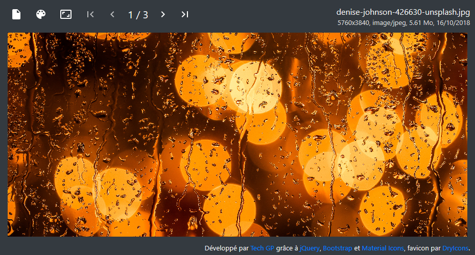

# webapps-diaporama

A simple diaporama application using HTML5, JavaScript and CSS3.

## Présentation

[Cette application](http://techgp.fr/webapps/webapps-diaporama.html) écrite en HTML5, JavaScript et CSS3 vous permettra de visualiser des photos ou des images.

Les librairies suivantes ont été utilisées pour cette application :

- [jQuery 2.2.1](http://jquery.com/) sous licence MIT
- [jQuery Mobile 1.4.5](http://jquerymobile.com/) sous licence MIT pour les évènements 'swipeleft' et 'swiperight'
- [Bootstrap 3.3.6](http://getbootstrap.com/css/) sous licence MIT

L'application est fournie avec un fichier manifest `webapps-diaporama.appcache` permettant la mise en cache et l'utilisation en mode déconnecté. Plus d'info chez Mozilla [en français](https://developer.mozilla.org/fr/docs/Utiliser_Application_Cache) ou [en anglais](https://developer.mozilla.org/en-US/docs/Web/HTML/Using_the_application_cache).

NB : quand le certificat HTTPS est incorrect, la mise en cache échouera sous Chrome avec l'erreur `Manifest fetch Failed (9)`. Dans ce cas, faites les tests en HTTP et/ou utilisez un certificat valide en production.

## Captures d'écran

### Présentation de l'IHM

